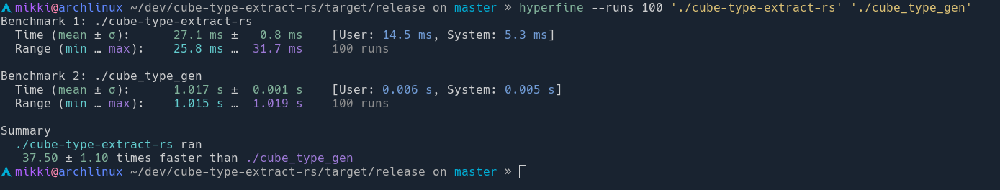

# Cube Type Extractor - rs
 

This is the Rust rewrite of the [Cube Type Extractor](https://github.com/mikkurogue/cube-type-extract) project that was initially written in Go.

The reason for this rewrite is not because of the meme, but because it's a relatively simple and small project to learn Rust with that has some core concepts for programming.

This project will essentially be a 1 to 1 copy so the configuration, commands and everything else should all be the same.

## Initial benchmark results

As we can see from the results. The Rust version is around 37.5 times faster than the Go version
Benchmark 1 is the Rust version, Benchmark 2 is the Go version.

### Caveat

Eventually, I will also create a Zig rewrite of this to compare all 3 binaries, not because its supposed to create a dick measuring contest for the communities of each respective language but simply because I want to see if what I wrote is at all comparable to each other given I am new to Rust in ints entirety and Zig I am at best an advanced beginner.
